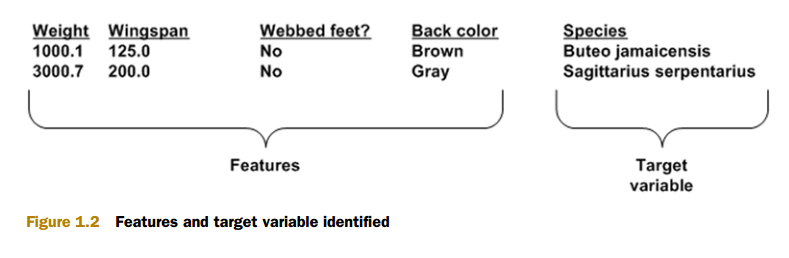

# 机器学习基础 #

**机器学习能让我们自数据集中受到启发，换句话说利用计算机来彰显数据背后的真实含义。**

### 机器学习在日常生活中的应用 ###

1.人脸识别

2.手写数字识别

3.垃圾邮件过滤

4.电商的产品推荐 

5.天气预测

6.疾病诊断

...

### 何为机器学习 ###

**机器学习就是把无序的数据转换成有用的信息**

**机器学习用到统计学，为什么用统计学呢？**

在现实生活中，并不是每一个问题都存在确定的解决方案。在很多时候，我们都无法透彻地理解问题，或者没有足够的计算资源为问题精确建立模型，例如我们无法给人类活动的动机建立模型。为了解决这些问题，我们需要用到统计学知识。

### 关键术语 ###

**专家系统**（如：鸟类分类系统）

**特征feature（属性attributes）**（如：鸟的体重、翼展、背后颜色）

机器学习的主要任务就是**分类**（从众多其他鸟类中分辨出啄木鸟）

决定使用某个机器学习算法进行分类，首先要做的**算法训练**，即如何如何分类。

通常我们为算法输入大量已分类数据作为**训练集**

上图表包含6个训练样本的训练集

上图阐述特征与**目标变量Target Variable**

目标变量是机器学习算法的预测结果

训练样本集必须确定知道目标变量的值，以便机器学习算法可以发现特征和目标变量之间的关系。

为了测试机器学习算法的效果，通常使用两套独立的样品集：**训练数据**和**测试数据**。

比较测试样品预测的慕不爱变量值与实际样品类别之间的差距，就可以得出算法的实际精确度。

**知识表示knowledge representation**：假定这个鸟类分类程序，经过测试满足精确度要求，是否我们就可以看到机器已经学会了如何区分不同的鸟类？这个工作称之为知识表示。**知识表示可以**采用规则集的形式，也可以采用概率分布形式，甚至可以是训练样品集中的一个实例。

### 机器学习的主要任务 ###

**监督学习**（这类算法必须知道预测什么，即目标变量的分类信息）

1.分类（主要任务是将实例数据划分为合适的分类中）

2.回归（主要用于数值型数据,例子：通过给定数据点的最优拟合曲线）

**无监督学习**（此时数据没有类别信息，也不会给定目标类）

1.聚类（将数据集合分成由类似的对象组成的多个类的过程）

2.密度估计（寻找描述数据统计值的过程）

3.可以减少数据特征的维度，以便可以使用二维或三维图形更加直观地展示数据

**机器学习用到的算法**

### 如何选择合适的算法 ###

必须考虑下面两个问题：

1.使用机器学习算法的目的，想要完成何种任务？（注意这不是一成不变的）
    
	if(想要预测目标变量的值){
		//监督学习算法

		if(目标变量类型值 == 离散型){//是，否）1、2、3）红、黑、黄）
			分类算法
		}else if(目标变量类型值 == 连续型){//0~100,-999~999
			回归算法
		}
	}else{
		//无监督学习算法

		if(将数据划分为离散的组){
			聚类算法
		}

		if(将数据划分为离散的组&&估计数据与每个分组的相似程度){
			密度估计算法
		}
		
	}

2.需要分析或收集的数据是什么？

主要应该了解数据的以下特征：特征值是离散型变量还是连续型变量，特征值中是否存在缺失的值，何种原因造成缺失值，数据中是否存在异常值，某个特征发生的频率如何等等。

### 开发机器学习应用程序的步骤 ###

1. 收集数据

2. 准备输入数据

3. 分析输入数据

4. 训练算法

5. 测试算法

6. 使用算法

### 使用Python为机器学习算法语言 ###

本书要安装Python2

1.其语法清晰

2.易于操作纯文本文件

3.有很的生态支持

### 安装NumPy库 ###

机器学习算法涉及很多线性代数知识

	pip install numpy

---

numpy初体验

	# -*- coding: utf-8 -*- 
	
	from numpy import *
	
	array = random.rand(4, 4)
	
	print array#随机4 * 4数组
	print "----------------------------------------"
	
	randMat = mat(array) #数组转换成矩阵
	
	print randMat
	print "----------------------------------------"
	
	invRandMat = randMat.I #矩阵求逆
	
	print invRandMat 
	print "----------------------------------------"
	
	myEye = randMat * invRandMat#矩阵相乘
	
	print myEye
	print "----------------------------------------"
	
	pure = myEye - eye(4, 4)#eye(4, 4) 创建单位矩阵
	
	print pure
	
	"""
	[[0.59774478 0.27667655 0.83676654 0.34214905]
	 [0.15510116 0.34282224 0.67390717 0.82408148]
	 [0.74861786 0.72573314 0.76544715 0.04513842]
	 [0.73328569 0.08812684 0.72491471 0.48711059]]
	----------------------------------------
	[[0.59774478 0.27667655 0.83676654 0.34214905]
	 [0.15510116 0.34282224 0.67390717 0.82408148]
	 [0.74861786 0.72573314 0.76544715 0.04513842]
	 [0.73328569 0.08812684 0.72491471 0.48711059]]
	----------------------------------------
	[[-3.08488433 -0.49366735  1.05662269  2.90410042]
	 [-2.21556483  0.95867519  1.79791501 -0.23224319]
	 [ 5.28389187 -0.50394398 -1.44547134 -2.72492819]
	 [-2.81870016  1.319681    0.2352496   1.77838899]]
	----------------------------------------
	[[ 1.00000000e+00  1.11022302e-16  1.38777878e-17  1.11022302e-16]
	 [-4.44089210e-16  1.00000000e+00  1.38777878e-16  2.22044605e-16]
	 [-3.60822483e-16  2.08166817e-17  1.00000000e+00 -8.32667268e-17]
	 [-6.66133815e-16  1.11022302e-16 -1.66533454e-16  1.00000000e+00]]
	----------------------------------------
	[[ 0.00000000e+00  1.11022302e-16  1.38777878e-17  1.11022302e-16]
	 [-4.44089210e-16  0.00000000e+00  1.38777878e-16  2.22044605e-16]
	 [-3.60822483e-16  2.08166817e-17 -1.11022302e-16 -8.32667268e-17]
	 [-6.66133815e-16  1.11022302e-16 -1.66533454e-16  0.00000000e+00]]
	"""
	
