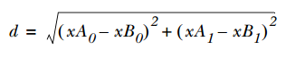
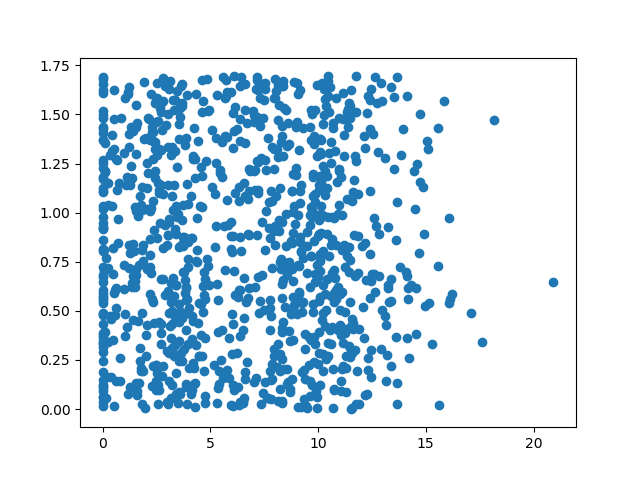
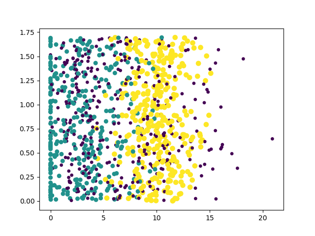

# k-近邻算法 #

它采用测量不同特征值之间的距离方法进行分类

- 优：精度高、对异常值不敏感、无数据输入假定
- 缺：计算复杂度高、空间复杂度高
- 适用数据范围：数值型和标称型

### 算法具体原理 ###

存在一个样本数据集合（训练样品集），并且样本集中每个数据都存在标签，即我们知道样本集中每一个数据与所属分类的对应关系。

输入没有标签的新数据后，将新数据的每个特征与样品集中数据对应的特征进行比较，然后算法提取样本集中特征最相近数据（最邻近）的分类标签。

一般来说，只选择样本数据集中前k个最相似的数据，这就是k-近邻算法中K的出处，通常k是不大于20的整数。

最后，选择k个最相似数据中出现次数最多的分类，作为新数据的分类。

### kNN分类算法 ###

伪代码

1. 计算已知类别数据集中的点 与 当前点之间的距离；
2. 按照距离递增次序排序；
3. 选取 与 当前距离最小的k个点；
4. 确定 前k个点所在类别的出现频率；
5. 返回 前k个点出现频率最高的类别作为当前点的预测分类。

1用到 **欧式距离公式**

----

	def classify0(inX, dataSet, labels, k):
		
		#距离计算
		dataSetSize = dataSet.shape[0] #numpy库数组的行数
		diffMat = tile(inX, (dataSetSize,1)) - dataSet 

		#tile复制inX dataSetSize行数倍，以便相减
		sqDiffMat = diffMat**2

		sqDistances = sqDiffMat.sum(axis=1) 
		#axis＝0表示按列相加，axis＝1表示按照行的方向相加

		#开二次方
		distances = sqDistances**0.5

		sortedDistIndicies = distances.argsort() 
		#将元素从小到大排序，提取对应的index,然后输出返回，如x[3]=-1,y[0]=3
		
		#选择距离最小的k个点
		classCount={} #python对象         
		for i in range(k):
		    voteIlabel = labels[sortedDistIndicies[i]]
		    classCount[voteIlabel] = classCount.get(voteIlabel,0) + 1 #设置键 值 + 1
		
		#排序
		sortedClassCount = sorted(classCount.iteritems(), key=operator.itemgetter(1), reverse=True)
		
		#operator.itemgetter(1)返回函数，得classCount K-V的V，对V进行排序，因设置reverse，从左到右，从大到小
		return sortedClassCount[0][0]

示例使用
		
	def createDataSet():
		    group = array([[1.0,1.1],[1.0,1.0],[0,0],[0,0.1]])
		    labels = ['A','A','B','B']
		    return group, labels

	group, labels = createDataSet()

	#最后输出值
	print classify0([0, 0], group, labels, 3) #输出 B
	
### 示例1：使用k-近邻算法改进约会网站的配对效果 ###

#### 1.准备数据：从文本中解析数据 ####

---

	def file2matrix(filename):
	    fr = open(filename)
	    numberOfLines = len(fr.readlines())         #get the number of lines in the file
	    returnMat = zeros((numberOfLines,3))        #prepare matrix to return
	    classLabelVector = []                       #prepare labels return   
	    fr = open(filename)
	    index = 0
	    for line in fr.readlines():
	        line = line.strip()
	        listFromLine = line.split('\t')
	        returnMat[index,:] = listFromLine[0:3]
	        classLabelVector.append(int(listFromLine[-1]))
	        index += 1
	    return returnMat,classLabelVector

---
	>>>datingDataMat, datingLabels = kNN.file2matrix('datingTestSet2.txt')
	
	>>>print datingDataMat
	[[  4.09200000e+04   8.32697600e+00   9.53952000e-01]
	 [  1.44880000e+04   7.15346900e+00   1.67390400e+00]
	 [  2.60520000e+04   1.44187100e+00   8.05124000e-01]
	 ..., 
	 [  2.65750000e+04   1.06501020e+01   8.66627000e-01]
	 [  4.81110000e+04   9.13452800e+00   7.28045000e-01]
	 [  4.37570000e+04   7.88260100e+00   1.33244600e+00]]
	
	>>>print datingLabels[0:20]
	[3, 2, 1, 1, 1, 1, 3, 3, 1, 3, 1, 1, 2, 1, 1, 1, 1, 1, 2, 3]

#### 2.分析数据：使用Matplotllib创建散点图（需pip install matplotlib） ####
	
	import matplotlib
	import matplotlib.pyplot as plt
	from numpy import *
	fig = plt.figure()
	ax = fig.add_subplot(111)#1行1列1图
	ax.scatter(datingDataMat[:, 1], datingDataMat[:, 2]) 

	#datingDataMat[:, 1] /*返回所有行，第2列*/
	plt.show()

	#附带尺寸、颜色参数
	ax.scatter(datingDataMat[:, 1], datingDataMat[:, 2] \
           , 15.0*array(datingLabels), 15.0*array(datingLabels))
	plt.show()

#### 3.准备数据：归一化数值 ####

有时发现数据中的不同特征的特征值相差甚远，会影响计算结果

*处理方法*

将数值归一化，如将取值范围处理为0到1或者-1到之间。公式：

	newValue = (oldValue - min) / (max - min)

---
	def autoNorm(dataSet):
	    minVals = dataSet.min(0)#从每列中选出最小值
	    maxVals = dataSet.max(0)#从每列中选出最大值
	    ranges = maxVals - minVals#范围
	    normDataSet = zeros(shape(dataSet))#行宽和dataSet相同的00矩阵
	    m = dataSet.shape[0]#dataSet有多少个实例
	    normDataSet = dataSet - tile(minVals, (m,1))
		
		#tile将数组A重复n次,上例子minVals,重复m次，1表示
		#tile(a,(2,1))就是把a先沿x轴（就这样称呼吧）复制1倍，即没有复制，仍然是 [0,1,2]。 再把结果沿y方向复制2倍		

	    normDataSet = normDataSet / tile(ranges, (m,1))   #element wise divide
	    return normDataSet, ranges, minVals

---
	>>>normMat, ranges, minVals = kNN.autoNorm(datingDataMat)
	>>>normMat
	[[ 0.44832535  0.39805139  0.56233353]
	 [ 0.15873259  0.34195467  0.98724416]
	 [ 0.28542943  0.06892523  0.47449629]
	 ..., 
	 [ 0.29115949  0.50910294  0.51079493]
	 [ 0.52711097  0.43665451  0.4290048 ]
	 [ 0.47940793  0.3768091   0.78571804]]

	>>>ranges
	[  9.12730000e+04   2.09193490e+01   1.69436100e+00]

	>>>minVals
	[ 0.        0.        0.001156]

#### 4.测试算法：作为完整程序验证分类器 ####
	
机器学习算法一个重要的工作就是评估算法的正确率，通常提供已有数据的90%作为训练样品分类器，而使用其余的10%数据去测试分类器，检测出分类器的正确率。

	def datingClassTest():
		#取50%的数据进行测试
	    hoRatio = 0.50      #hold out 10% 
	    
		#处理数据
		datingDataMat,datingLabels = file2matrix('datingTestSet2.txt')       #load data setfrom file
	    
		#数据归一化处理
		normMat, ranges, minVals = autoNorm(datingDataMat)
	    m = normMat.shape[0]

		#拿来 测试条目 数目
	    numTestVecs = int(m*hoRatio)
	    errorCount = 0.0
	    
		for i in range(numTestVecs):
	        #kNN核心算法
			classifierResult = classify0(normMat[i,:],normMat[numTestVecs:m,:],datingLabels[numTestVecs:m],3)

			#输出结果
	        print "the classifier came back with: %d, the real answer is: %d" % (classifierResult, datingLabels[i])

			#统计错误数
	        if (classifierResult != datingLabels[i]): 
				errorCount += 1.0
	    
		print "the total error rate is: %f" % (errorCount/float(numTestVecs))
	    print 'errorCount: '+str(errorCount)

---
	>>>datingClassTest()
	...
	the classifier came back with: 2, the real answer is: 1
	the classifier came back with: 2, the real answer is: 2
	the classifier came back with: 1, the real answer is: 1
	the classifier came back with: 1, the real answer is: 1
	the classifier came back with: 2, the real answer is: 2
	the total error rate is: 0.064000
	errorCount: 32.0

#### 5.使用算法：构建完整可用系统 ####

	def classifyPerson(file):
	    resultList = ['not at all','in small doses', 'in large doses']
	    percentTats = float(raw_input(\
	                 "percentage of time spent playing video games?"))
	    ffMiles = float(raw_input("frequent flier miles earned per year?"))
	    
	    iceCream = float(raw_input("liters of ice cream consumed per year?"))
	    
	    datingDataMat,datingLabels = file2matrix(file)
	    
	    normMat, ranges, minVals = autoNorm(datingDataMat)
	    
	    inArr = array([ffMiles, percentTats, iceCream])
	    
	    classifierResult = classify0((inArr- \
	                                  minVals)/ranges,normMat,datingLabels,3)
	    print "You will probably like this person: ",\
	                                    resultList[classifierResult - 1]

	kNN.classifyPerson('..\\datingTestSet2.txt')

结果

	percentage of time spent playing video games?10
	frequent flier miles earned per year?10000
	liters of ice cream consumed per year?0.5
	You will probably like this person:  in small doses

### 示例2：手写识别系统 ###

#### 1.准备数据：将图像装换为测试向量 ####

trainingDigits 2000个训练样本

testDigitsa 900个测试数据

某一示例

00000000000001111000000000000000
00000000000011111110000000000000
00000000001111111111000000000000
00000001111111111111100000000000
00000001111111011111100000000000
00000011111110000011110000000000
00000011111110000000111000000000
00000011111110000000111100000000
00000011111110000000011100000000
00000011111110000000011100000000
00000011111100000000011110000000
00000011111100000000001110000000
00000011111100000000001110000000
00000001111110000000000111000000
00000001111110000000000111000000
00000001111110000000000111000000
00000001111110000000000111000000
00000011111110000000001111000000
00000011110110000000001111000000
00000011110000000000011110000000
00000001111000000000001111000000
00000001111000000000011111000000
00000001111000000000111110000000
00000001111000000001111100000000
00000000111000000111111000000000
00000000111100011111110000000000
00000000111111111111110000000000
00000000011111111111110000000000
00000000011111111111100000000000
00000000001111111110000000000000
00000000000111110000000000000000
00000000000011000000000000000000

**将把一个32 * 32的二进制图像矩阵装换为1 * 1024的向量**

	def img2vector(filename):
	    returnVect = zeros((1,1024))#创建有1024个元素的列表
	    fr = open(filename)
	    for i in range(32):
	        lineStr = fr.readline()
	        for j in range(32):
	            returnVect[0,32*i+j] = int(lineStr[j])
	    return returnVect

---

	>>>testVector = kNN.img2vector('testDigits/0_13.txt')

	>>>testVector[0, 0:31]
	[ 0.  0.  0.  0.  0.  0.  0.  0.  0.  0.  0.  0.  0.  0.  1.  1.  1.  1. 0.  0.  0.  0.  0.  0.  0.  0.  0.  0.  0.  0.  0.]

	>>>testVector[0, 32:63]
	[ 0.  0.  0.  0.  0.  0.  0.  0.  0.  0.  0.  0.  1.  1.  1.  1.  1.  1. 1.  0.  0.  0.  0.  0.  0.  0.  0.  0.  0.  0.  0.]

#### 2.测试算法：使用k-近邻算法识别手写数字 ####

	import os

	def handwritingClassTest():
		#准备训练数据和测试数据
		hwLabels = []
	    trainingFileList = os.listdir('trainingDigits')           #load the training set
	    m = len(trainingFileList)
	    trainingMat = zeros((m,1024))
	    for i in range(m):
	        fileNameStr = trainingFileList[i]
	        fileStr = fileNameStr.split('.')[0]     #take off .txt
	        classNumStr = int(fileStr.split('_')[0])
	        hwLabels.append(classNumStr)
	        trainingMat[i,:] = img2vector('trainingDigits/%s' % fileNameStr)

	    testFileList = os.listdir('testDigits')        #iterate through the test set
	    errorCount = 0.0
	    mTest = len(testFileList)

		#开始测试
	    for i in range(mTest):
	        fileNameStr = testFileList[i]
	        fileStr = fileNameStr.split('.')[0]     #take off .txt
	        classNumStr = int(fileStr.split('_')[0])

	        vectorUnderTest = img2vector('testDigits/%s' % fileNameStr)
	        classifierResult = classify0(vectorUnderTest, trainingMat, hwLabels, 3)

	        print "the classifier came back with: %d, the real answer is: %d" % (classifierResult, classNumStr)
	        if (classifierResult != classNumStr): errorCount += 1.0
	    print "\nthe total number of errors is: %d" % errorCount
	    print "\nthe total error rate is: %f" % (errorCount/float(mTest))

---
	>>>handwritingClassTest()
	
	...
	the classifier came back with: 9, the real answer is: 9
	the classifier came back with: 9, the real answer is: 9
	the classifier came back with: 9, the real answer is: 9
	the classifier came back with: 9, the real answer is: 9
	the classifier came back with: 9, the real answer is: 9
	the classifier came back with: 9, the real answer is: 9
	the classifier came back with: 9, the real answer is: 9
	
	the total number of errors is: 11
	
	the total error rate is: 0.011628

实际使用这个算法时，算法的执行效率并不高

### 总结 ###

k决策树就是k-近邻算法的优化版，可以节省大量的计算开销

k-近邻算法是分类数据最简单最有效的算法。

k-近邻算法是基于实例的学习，使用算法时我们必须有接近实际数据的训练样本数据。

k-近邻算法必须保存全部数据集，如果训练数据集很大，必须使用大量的存储空间。

此外，由于必须对数据集中的每个数据计算距离值，实际使用时可能非常耗时。

k-近邻算法的另一个缺陷是它无法给出任何数据的基础结构信息，因此无法知晓平均实例样本的典型实例样本具有什么特征。