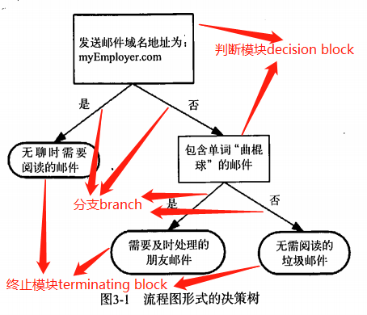
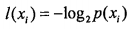
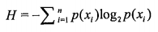
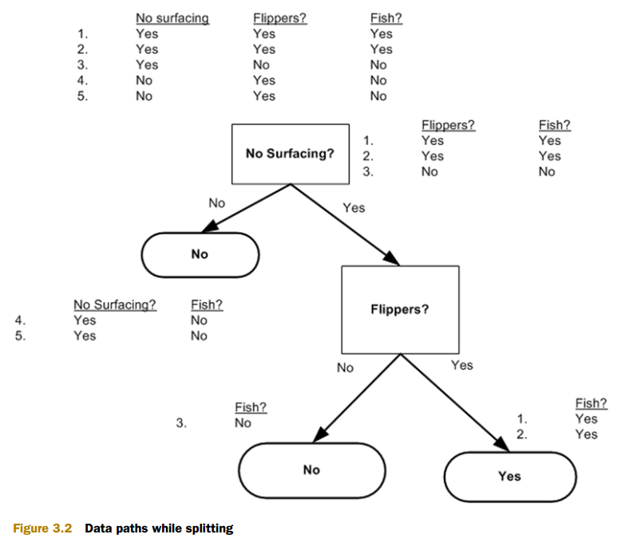
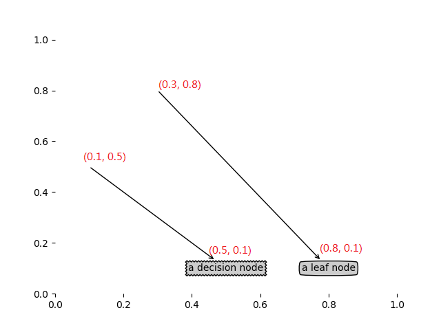
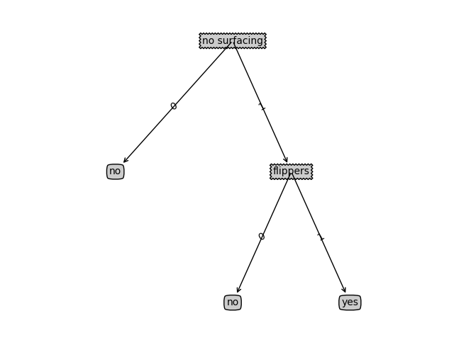
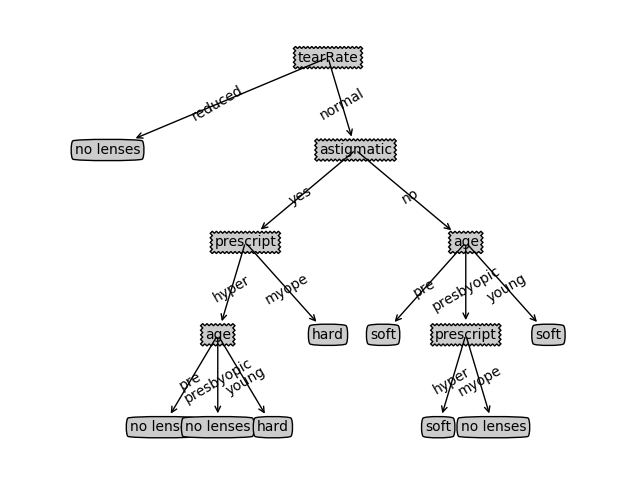

# 决策树decision trees #

**kNN算法可以完成很多分类任务，但是它最大的缺点就是给出数据的内在含义，决策树的主要优势就在于数据形式非常容易理解**

### 决策树的构造 ###

**决策树**

优点：计算复杂度不高，输出结果易于理解，对中间值的缺失不敏感，可以处理不相关特征数据。

缺点：可能会产生过度匹配问题。

适用数据类型：数值型和标称型。

创建分支的伪代码函数createBranch()

	Check if every item in the dataset is in the same class:
		If so return the class label
		Else
			find the best feature to split the data
			split the dataset
			create a branch node
				for each split
					call createBranch() and add the result to the branch node
		return branch node

示例数据

**海洋生物数据**

<table>

<tr>
<td>不浮出水面是否可以生存</td>
<td>是否有脚蹼</td>
<td>属于鱼类</td>
</tr>

<tr>
<td>是</td>
<td>是</td>
<td>是</td>
</tr>

<tr>
<td>是</td>
<td>是</td>
<td>是</td>
</tr>

<tr>
<td>是</td>
<td>否</td>
<td>否</td>
</tr>

<tr>
<td>否</td>
<td>是</td>
<td>否</td>
</tr>

<tr>
<td>否</td>
<td>是</td>
<td>否</td>
</tr>

</table>

#### 信息增益 Information gain ####

划分数据集的大原则是：将无序的数据变得更加有序。

组织杂乱无章数据的一种方法就是使用 **信息论** 度量信息。

在划分数据集之前之后信息发生的变化称为 **信息增益**.

知道如何计算信息增益，就可以计算某个特征值划分数据集获得的信息增益，获得信息增益最高的特征就是最好的选择。

冯 诺依曼 建议使用 **熵** 这术语

信息增益是熵(数据无序度)的减少，大家肯定对于将熵用于度量数据无序度的减少更容易理解。

集合信息的度量称为**香农熵** 或者 简称 **熵(entropy)**。（更多熵知识请移步至 [WhatIsInformationEntropy.doc](WhatIsInformationEntropy.doc)）

**熵定义为信息的期望值**

信息定义

如果待分类的事务可能划分在多个分类之中，则符号Xi的信息定义为

其中p(Xi)是选择该分类的概率。

为了计算熵，我们需要计算所有分类别所有可能值包含的信息期望值，通过下面的公式得到

**计算给定数据集的香农熵**

	def calcShannonEnt(dataSet):

		#实例总数
	    numEntries = len(dataSet)
	    
		labelCounts = {}
	    
		#the the number of unique elements and their occurance
		#统计目标变量的值出现的次数
		for featVec in dataSet: 
			#每个实例的最后一项是目标变量
	        currentLabel = featVec[-1]
	        if currentLabel not in labelCounts.keys(): labelCounts[currentLabel] = 0
	        labelCounts[currentLabel] += 1
	    shannonEnt = 0.0

		#利用上面的公式计算出香农熵
	    for key in labelCounts:
	        prob = float(labelCounts[key])/numEntries
	        shannonEnt -= prob * log(prob,2) #log base 2
	    return shannonEnt

创建数据集

	def createDataSet():
	    dataSet = [[1, 1, 'yes'],
	               [1, 1, 'yes'],
	               [1, 0, 'no'],
	               [0, 1, 'no'],
	               [0, 1, 'no']]
	    labels = ['no surfacing','flippers']
	    #change to discrete values
	    return dataSet, labels

运行

	# -*- coding: utf-8 -*- 
	import trees
	
	dataSet, labels = trees.createDataSet()
	
	print dataSet
	#[[1, 1, 'yes'], [1, 1, 'yes'], [1, 0, 'no'], [0, 1, 'no'], [0, 1, 'no']]
	print labels
	#['no surfacing', 'flippers']
	
	#计算熵
	print trees.calcShannonEnt(dataSet)
	#0.970950594455
	
	#改变多一个数据
	dataSet[0][-1] = 'maybe'
	
	print dataSet
	#[[1, 1, 'maybe'], [1, 1, 'yes'], [1, 0, 'no'], [0, 1, 'no'], [0, 1, 'no']]
	print trees.calcShannonEnt(dataSet)
	#1.37095059445

**熵越大，则混合的数据越多**

**延伸**：另一个度量集合无序程度的方法是**基尼不纯度**,简单地说就是从一个数据集中随机选取子项，度量其被错误分类到其他分组的概率。

#### 划分数据集 ####

	#axis表示第n列
	#返回剔除第n列数据的数据集
	def splitDataSet(dataSet, axis, value):
	    retDataSet = []
	    for featVec in dataSet:
	        if featVec[axis] == value:
				#剔除第n列数据
	            reducedFeatVec = featVec[:axis] 
			    
	            reducedFeatVec.extend(featVec[axis+1:])
				
	            retDataSet.append(reducedFeatVec)
	    return retDataSet

---
运行

	print dataSet
	#[[1, 1, 'yes'], [1, 1, 'yes'], [1, 0, 'no'], [0, 1, 'no'], [0, 1, 'no']]
	#划分数据集
	
	#当第0列时，值为0 的实例
	print trees.splitDataSet(dataSet, 0, 0)
	#[[1, 'no'], [1, 'no']]
	
	
	#当第0列时，值为1 的实例
	print trees.splitDataSet(dataSet, 0, 1)
	#[[1, 'yes'], [1, 'yes'], [0, 'no']]

---
	#append 和 extend 区别
	>>> a=[1,2,3]
	>>> b=[4,5,6]
	>>> a.append(b)
	>>> a
	[1, 2, 3, [4, 5, 6]]
	>>> a=[1,2,3]
	>>> a.extend(b)
	>>> a
	[1, 2, 3, 4, 5, 6]

---

	#选择最好的数据集划分方式
	def chooseBestFeatureToSplit(dataSet):
		#有多少个特征数量,最后一个目标变量
	    numFeatures = len(dataSet[0]) - 1

		#计算基准 香农熵 目标变量的熵
		baseEntropy = calcShannonEnt(dataSet)
	    bestInfoGain = 0.0; bestFeature = -1
	    
		#迭代特征，i是列数
		for i in range(numFeatures):        

			#该特征（一列）下 所有值
			#使用 列表推倒 （List Comprehension）
			featList = [example[i] for example in dataSet] 

			#特征值去重
	        uniqueVals = set(featList)
	        
			newEntropy = 0.0
			
	        for value in uniqueVals:
				#返回剔除第i列数据的数据集
	            subDataSet = splitDataSet(dataSet, i, value)

	            prob = len(subDataSet)/float(len(dataSet))
	            #新的香农熵
				#有点不清楚这公式
				newEntropy += prob * calcShannonEnt(subDataSet)     
			#计算增益
			infoGain = baseEntropy - newEntropy
			
			#选择最大增益，增益越大，区分越大
	        if (infoGain > bestInfoGain):

	            bestInfoGain = infoGain
	            bestFeature = i
		
	    return bestFeature

---
运行

	print trees.chooseBestFeatureToSplit(dataSet)
	#0
	#这运行结果告诉我们，第0特征是最好的用于划分数据集的特征

	#chooseBestFeatureToSplit(dataSet)的一些中间变量的值
	#baseEntropy: 0.970950594455	

	#第0列
	#value: 0
	#value: 1
	#newEntropy: 0.550977500433
	
	#第1列
	#value: 0
	#value: 1
	#newEntropy: 0.8

#### 递归构建决策树 ####

**返回出现次数最多的分类名称**

	def majorityCnt(classList):
	    classCount={}
	    for vote in classList:
	        if vote not in classCount.keys(): classCount[vote] = 0
	        classCount[vote] += 1
	    sortedClassCount = sorted(classCount.iteritems(), key=operator.itemgetter(1), reverse=True)
	    return sortedClassCount[0][0]

**创建树的函数代码**

	def createTree(dataSet,labels):
		#目标变量的值
	    classList = [example[-1] for example in dataSet]
	    
		#stop splitting when all of the classes are equal
		if classList.count(classList[0]) == len(classList): 
	        return classList[0]
		
		#stop splitting when there are no more features in dataSet
	    if len(dataSet[0]) == 1: 
	        return majorityCnt(classList)

	    bestFeat = chooseBestFeatureToSplit(dataSet)
	    bestFeatLabel = labels[bestFeat]
	    
		myTree = {bestFeatLabel:{}}
	    del(labels[bestFeat])
	    
		featValues = [example[bestFeat] for example in dataSet]
	    uniqueVals = set(featValues)
	    
		for value in uniqueVals:
			#copy all of labels, so trees don't mess up existing labels
	        subLabels = labels[:]       
	        myTree[bestFeatLabel][value] = createTree(splitDataSet(dataSet, bestFeat, value),subLabels)
	    return myTree

运行结果

	print "---createTree---"
	
	print trees.createTree(dataSet, labels)
	
	"""
	---createTree---
	classList: 
	['yes', 'yes', 'no', 'no', 'no']
	baseEntropy: 0.970950594455
	value: 0
	value: 1
	newEntropy: 0.550977500433
	value: 0
	value: 1
	newEntropy: 0.8
	---
	classList: 
	['no', 'no']
	---
	classList: 
	['yes', 'yes', 'no']
	baseEntropy: 0.918295834054
	value: 0
	value: 1
	newEntropy: 0.0
	---
	classList: 
	['no']
	---
	classList: 
	['yes', 'yes']

	---最终运行结果---	
	{'no surfacing': {0: 'no', 1: {'flippers': {0: 'no', 1: 'yes'}}}}
	"""

### 在Python中使用Matplotlib注解绘制树形图 ###

#### Matplotlib注解annotate ####

	import matplotlib.pyplot as plt
	
	decisionNode = dict(boxstyle="sawtooth", fc="0.8")
	leafNode = dict(boxstyle="round4", fc="0.8")
	arrow_args = dict(arrowstyle="<-")
	
	#绘制节点
	def plotNode(nodeTxt, centerPt, parentPt, nodeType):
	    createPlot.ax1.annotate(nodeTxt, xy=parentPt,  xycoords='axes fraction',
	             xytext=centerPt, textcoords='axes fraction',
	             va="center", ha="center", bbox=nodeType, arrowprops=arrow_args )
	
	def createPlot():
	    fig = plt.figure(1, facecolor='white')
	    fig.clf()
	    createPlot.ax1 = plt.subplot(111, frameon=False) #ticks for demo puropses 
	    plotNode('a decision node', (0.5, 0.1), (0.1, 0.5), decisionNode)
	    plotNode('a leaf node', (0.8, 0.1), (0.3, 0.8), leafNode)
	    plt.show()
	
	print createPlot#<function createPlot at 0x0000000007636F98>
	
	createPlot()
	
	print createPlot.ax1#AxesSubplot(0.125,0.11;0.775x0.77)

**注意：红色的坐标是后来加上去的，不是上面程序生成的。**

#### 构造注解树 ####

**获取叶节点的数目和树的层数**

	def getNumLeafs(myTree):
	    numLeafs = 0
	    firstStr = myTree.keys()[0]
	    secondDict = myTree[firstStr]
	    for key in secondDict.keys():
	        if type(secondDict[key]).__name__=='dict':#test to see if the nodes are dictonaires, if not they are leaf nodes
	            numLeafs += getNumLeafs(secondDict[key])
	        else:   numLeafs +=1
	    return numLeafs
	
	def getTreeDepth(myTree):
	    maxDepth = 0
	    firstStr = myTree.keys()[0]
	    secondDict = myTree[firstStr]
	    for key in secondDict.keys():
	        if type(secondDict[key]).__name__=='dict':#test to see if the nodes are dictonaires, if not they are leaf nodes
	            thisDepth = 1 + getTreeDepth(secondDict[key])
	        else:   thisDepth = 1
	        if thisDepth > maxDepth: maxDepth = thisDepth
	    return maxDepth
	
	def retrieveTree(i):
	    listOfTrees =[{'no surfacing': {0: 'no', 1: {'flippers': {0: 'no', 1: 'yes'}}}},
	                  {'no surfacing': {0: 'no', 1: {'flippers': {0: {'head': {0: 'no', 1: 'yes'}}, 1: 'no'}}}}
	                  ]
	    return listOfTrees[i]
	
	
	myTree = retrieveTree(0)
	print "myTree: "
	print myTree
	
	print "getNumLeafs(myTree): "
	print getNumLeafs(myTree)
	
	
	print "getTreeDepth(myTree): "
	print getTreeDepth(myTree)
	
	# myTree: 
	# {'no surfacing': {0: 'no', 1: {'flippers': {0: 'no', 1: 'yes'}}}}
	# getNumLeafs(myTree): 
	# 3
	# getTreeDepth(myTree): 
	# 2

---

	#在父子节点间填充文本信息
	def plotMidText(cntrPt, parentPt, txtString):
	    xMid = (parentPt[0]-cntrPt[0])/2.0 + cntrPt[0]
	    yMid = (parentPt[1]-cntrPt[1])/2.0 + cntrPt[1]
	    createPlot.ax1.text(xMid, yMid, txtString, va="center", ha="center", rotation=30)
	
	
	def plotTree(myTree, parentPt, nodeTxt):
		#if the first key tells you what feat was split on
		#this determines the x width of this tree
	    numLeafs = getNumLeafs(myTree)  

	    depth = getTreeDepth(myTree)
		#the text label for this node should be this
	    firstStr = myTree.keys()[0]

	    cntrPt = (plotTree.xOff + (1.0 + float(numLeafs))/2.0/plotTree.totalW, plotTree.yOff)
	    plotMidText(cntrPt, parentPt, nodeTxt)
	    plotNode(firstStr, cntrPt, parentPt, decisionNode)

	    secondDict = myTree[firstStr]
	    plotTree.yOff = plotTree.yOff - 1.0/plotTree.totalD

	    for key in secondDict.keys():

			#test to see if the nodes are dictonaires, if not they are leaf nodes
	        if type(secondDict[key]).__name__=='dict':
				
				#recursion递归调用
	            plotTree(secondDict[key],cntrPt,str(key))
	        else:
				#it's a leaf node print the leaf node绘制叶节点
	            plotTree.xOff = plotTree.xOff + 1.0/plotTree.totalW

	            plotNode(secondDict[key], (plotTree.xOff, plotTree.yOff), cntrPt, leafNode)

	            plotMidText((plotTree.xOff, plotTree.yOff), cntrPt, str(key))
	    plotTree.yOff = plotTree.yOff + 1.0/plotTree.totalD
	#if you do get a dictonary you know it's a tree, and the first element will be another dict
	
	def createPlot(inTree):
	    fig = plt.figure(1, facecolor='white')
	    fig.clf()

	    axprops = dict(xticks=[], yticks=[])
		#**axprops 表示 no ticks 不绘制坐标点
	    createPlot.ax1 = plt.subplot(111, frameon=False, **axprops)    

	    #createPlot.ax1 = plt.subplot(111, frameon=False) #ticks for demo puropses 

	    plotTree.totalW = float(getNumLeafs(inTree))
	    plotTree.totalD = float(getTreeDepth(inTree))
	    plotTree.xOff = -0.5/plotTree.totalW; plotTree.yOff = 1.0;
	    
		#绘制跟节点
		plotTree(inTree, (0.5,1.0), '')
	    plt.show()

运用

	# -*- coding: utf-8 -*- 
	
	import treePlotter
	
	myTree = treePlotter.retrieveTree(0)
	print myTree
	#{'no surfacing': {0: 'no', 1: {'flippers': {0: 'no', 1: 'yes'}}}}

	#开始绘制决策树
	treePlotter.createPlot(myTree)

### 测试算法：使用决策树执行分类 ###

	def classify(inputTree,featLabels,testVec):
	    firstStr = inputTree.keys()[0]
	    secondDict = inputTree[firstStr]
	    featIndex = featLabels.index(firstStr)
	    key = testVec[featIndex]
	    valueOfFeat = secondDict[key]
	    if isinstance(valueOfFeat, dict): 
	        classLabel = classify(valueOfFeat, featLabels, testVec)
	    else: classLabel = valueOfFeat
	    return classLabel

运行

	import treePlotter
	import trees
	
	dataSet, labels = trees.createDataSet()
	myTree = treePlotter.retrieveTree(0)
	
	print myTree
	
	
	print trees.classify(myTree, labels, [1, 0])
	#no
	
	print trees.classify(myTree, labels, [1, 1])
	#yes

### 决策树存储到本地 ###

为了节省计算时间，最好能够在每次执行分类时调用已经构造好的决策树。

	def storeTree(inputTree,filename):
	    import pickle
	    fw = open(filename,'w')
	    pickle.dump(inputTree,fw)
	    fw.close()
	    
	def grabTree(filename):
	    import pickle
	    fr = open(filename)
	    return pickle.load(fr)

运用

	import trees
	import treePlotter
	
	myTree = treePlotter.retrieveTree(0)
	#存储到'classifierStorage.txt'文件
	trees.storeTree(myTree, 'classifierStorage.txt')

	#再读取
	print trees.grabTree('classifierStorage.txt')
	#{'no surfacing': {0: 'no', 1: {'flippers': {0: 'no', 1: 'yes'}}}}

### 示例：使用决策树预测隐形眼镜类型 ###

数据集lenses.txt

	age	prescript药方	astigmatic散光的 tearRate撕裂率

	young	myope	no	reduced	no lenses
	young	myope	no	normal	soft
	young	myope	yes	reduced	no lenses
	young	myope	yes	normal	hard
	young	hyper	no	reduced	no lenses
	young	hyper	no	normal	soft
	young	hyper	yes	reduced	no lenses
	young	hyper	yes	normal	hard
	pre	myope	no	reduced	no lenses
	pre	myope	no	normal	soft
	pre	myope	yes	reduced	no lenses
	pre	myope	yes	normal	hard
	pre	hyper	no	reduced	no lenses
	pre	hyper	no	normal	soft
	pre	hyper	yes	reduced	no lenses
	pre	hyper	yes	normal	no lenses
	presbyopic	myope	no	reduced	no lenses
	presbyopic	myope	no	normal	no lenses
	presbyopic	myope	yes	reduced	no lenses
	presbyopic	myope	yes	normal	hard
	presbyopic	hyper	no	reduced	no lenses
	presbyopic	hyper	no	normal	soft
	presbyopic	hyper	yes	reduced	no lenses
	presbyopic	hyper	yes	normal	no lenses

pre 之前
presbyopic 远视眼的
myope 近视眼
hyper 超级

运用

	import trees
	import treePlotter
	
	fr=open('lenses.txt')
	lenses=[inst.strip().split('\t') for inst in fr.readlines()]
	lensesLabels=['age', 'prescript', 'astigmatic', 'tearRate']
	lensesTree = trees.createTree(lenses,lensesLabels)
	
	print "lensesTree: "
	print lensesTree
	#{'tearRate': {'reduced': 'no lenses', 'normal': {'astigmatic': {'yes': {'prescript': {'hyper': {'age': {'pre': 'no lenses', 'presbyopic': 'no lenses', 'young': 'hard'}}, 'myope': 'hard'}}, 'no': {'age': {'pre': 'soft', 'presbyopic': {'prescript': {'hyper': 'soft', 'myope': 'no lenses'}}, 'young': 'soft'}}}}}}
	
	treePlotter.createPlot(lensesTree)

生成的决策树图

### 总结 ###

上面决策树非常好地匹配了实验数据，然而这些匹配选项可能太多了。

我们将这种问题称之为**过度匹配Overfitting**。

为了减少过度匹配问题，可以裁剪决策树，去掉一些不必要的叶子节点。

如果叶子节点只能增加少许信息，则可以删除该节点，将它并入到其他叶子节点中。

上述阐述的是ID3算法，它是一个瑕不掩瑜的算法。

ID3算法**无法直接处理数值型int,double**的数据，尽管我们可以通过量化的方法将数值型转换为标称型数值，但是如果存在太多的特征划分，ID3算法仍然会面临其他问题。

