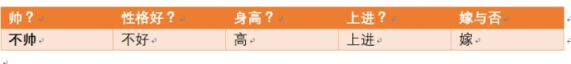

# 基于概率论的分类方法：朴素贝叶斯分类Naive Bayesian classification #

贝叶斯分类是一类分类算法的总称，这类算法均以贝叶斯定理为基础，故统称为贝叶斯分类。而朴素朴素贝叶斯分类是贝叶斯分类中最简单，也是常见的一种分类方法。

### 分类问题综述 ###

对于**分类问题**，其实谁都不会陌生，日常生活中我们每天都进行着分类过程。例如，当你看到一个人，你的脑子下意识判断他是学生还是社会上的人；你可能经常会走在路上对身旁的朋友说“这个人一看就很有钱、”之类的话，其实这就是一种分类操作。

既然是贝叶斯分类算法，那么**分类的数学描述**又是什么呢？

从数学角度来说，分类问题可做如下定义：

	已知集合C=y1,y2,..,yn和I=x1,x2,...x3，确定映射规则y = f()，使得任意xi∈I有且仅有一个yi∈C ,使得yi∈f(xi) 成立。

其中C叫做类别集合，其中每一个元素是一个类别，而I叫做项集合（特征集合），其中每一个元素是一个待分类项，f叫做分类器。**分类算法的任务就是构造分类器f**。

**分类算法的内容是要求给定特征，让我们得出类别，这也是所有分类问题的关键**。那么如何由指定特征，得到我们最终的类别，也是我们下面要讲的，每一个不同的分类算法，对应着不同的核心思想。

### 朴素贝叶斯分类 ###

那么既然是朴素贝叶斯分类算法，它的核心算法又是什么呢？

是下面这个贝叶斯公式：

换个表达形式就会明朗很多，如下：

**我们最终求的p(类别|特征)即可！就相当于完成了我们的任务**。

### 例题分析 ###

下面我先给出例子问题。

给定数据如下：

现在给我们的问题是，

	如果一对男女朋友，男生想女生求婚，男生的四个特点分别是不帅，性格不好，身高矮，不上进，请你判断一下女生是嫁还是不嫁？

这是一个典型的分类问题，**转为数学问题就是比较p(嫁|(不帅、性格不好、身高矮、不上进))与p(不嫁|(不帅、性格不好、身高矮、不上进))的概率，谁的概率大，我就能给出嫁或者不嫁的答案**！

这里我们联系到朴素贝叶斯公式：

我们需要求p(嫁|(不帅、性格不好、身高矮、不上进),这是我们不知道的，

但是通过朴素贝叶斯公式可以转化为好求的三个量，**p(不帅、性格不好、身高矮、不上进|嫁)、p（不帅、性格不好、身高矮、不上进)、p(嫁)**（至于为什么能求，后面会讲，那么就太好了，将待求的量转化为其它可求的值，这就相当于解决了我们的问题！）

### 朴素贝叶斯算法的朴素一词解释 ###

那么这三个量是如何求得？

是根据已知训练数据统计得来，下面详细给出该例子的求解过程。

回忆一下我们要求的公式如下：

那么我只要求得p(不帅、性格不好、身高矮、不上进|嫁)、p（不帅、性格不好、身高矮、不上进)、p(嫁)即可，好的，下面我分别求出这几个概率，最后一比，就得到最终结果。

**p(不帅、性格不好、身高矮、不上进|嫁) = p(不帅|嫁)*p(性格不好|嫁)*p(身高矮|嫁)*p(不上进|嫁)**，那么我就要分别统计后面几个概率，也就得到了左边的概率！

等等，**为什么这个成立呢？**学过概率论的同学可能有感觉了，这个等式成立的条件需要特征之间相互独立吧！

对的！这也就是为什么朴素贝叶斯分类有朴素一词的来源，**朴素贝叶斯算法是假设各个特征之间相互独立，那么这个等式就成立了**！

#### 为什么需要假设特征之间相互独立呢？ ####

1、我们这么想，假如没有这个假设，那么我们对右边这些概率的估计其实是不可做的，这么说，我们这个例子有4个特征，其中帅包括{帅，不帅}，性格包括{不好，好，爆好}，身高包括{高，矮，中}，上进包括{不上进，上进}，那么四个特征的联合概率分布总共是4维空间，总个数为2*3*3*2=36个。

24个，计算机扫描统计还可以，但是现实生活中，往往有非常多的特征，每一个特征的取值也是非常之多，那么通过统计来估计后面概率的值，变得几乎不可做，这也是为什么需要假设特征之间独立的原因。

2、假如我们没有假设特征之间相互独立，那么我们统计的时候，就需要在整个特征空间中去找，比如统计p(不帅、性格不好、身高矮、不上进|嫁),

我们就需要在嫁的条件下，去找四种特征全满足分别是不帅，性格不好，身高矮，不上进的人的个数，这样的话，**由于数据的稀疏性，很容易统计到0的情况**。 这样是不合适的。

根据上面俩个原因，朴素贝叶斯法对条件概率分布做了条件独立性的假设，由于这是一个较强的假设，朴素贝叶斯也由此得名！这一假设使得朴素贝叶斯法变得简单，但有时会牺牲一定的分类准确率。

好的，上面我解释了为什么可以拆成分开连乘形式。那么下面我们就开始求解！

### 开始求解 ###

将上面公式整理一下如下：

下面我将一个一个的进行统计计算（在数据量很大的时候，根据中心极限定理，频率是等于概率的，这里只是一个例子，所以我就进行统计即可）。

	p(嫁)=？

首先我们整理训练数据中，嫁的样本数如下：

	则 p(嫁) = 6/12（总样本数） = 1/2

---

	p(不帅|嫁)=？

	则p(不帅|嫁) = 3/6 = 1/2

---

	p(性格不好|嫁)= ？

	则p(性格不好|嫁)= 1/6

---

	p（矮|嫁） = ?

	则p(矮|嫁) = 1/6

---

	p(不上进|嫁) = ?

	则p(不上进|嫁) = 1/6

---

**下面开始求分母，p(不帅)，p（性格不好），p（矮），p（不上进）**

---

	p（不帅） = 4/12 = 1/3
	p（性格不好） = 4/12 = 1/3
	p（身高矮） = 7/12
	p（不上进） = 4/12 = 1/3

---

到这里，要求p(不帅、性格不好、身高矮、不上进|嫁)的所需项全部求出来了，下面我带入进去即可，

= (1/2 \* 1/6 \* 1/6 \* 1/6 \* 1/2) / (1/3 \* 1/3\* 7/12 \* 1/3)

同理可得：

= ((1/6 \* 1/2 \* 1\* 1/2) \* 1/2) / (1/3 \* 1/3 \* 7/12 \* 1/3)

### 结论 ###

很显然 ((1/6 \* 1/2 \* 1\* 1/2) \* 1/2) > (1/2 \* 1/6 \* 1/6 \* 1/6 \* 1/2)

于是有**p(不嫁|不帅、性格不好、身高矮、不上进) > p(嫁|不帅、性格不好、身高矮、不上进)**

所以我们根据朴素贝叶斯算法可以给这个女生答案，是**不嫁**！！！！

其实不用**计算分母p(不帅)，p（性格不好），p（矮），p（不上进）**, 在比较的过程当中会约去的。

### 朴素贝叶斯分类的优缺点 ###

优点：

- 算法逻辑简单,易于实现
- 分类过程中时空开销小

缺点：

理论上，朴素贝叶斯模型与其他分类方法相比具有最小的误差率。但是实际上并非总是如此，这是因为朴素贝叶斯模型假设属性之间相互独立，这个假设在实际应用中往往是不成立的，在属性个数比较多或者属性之间相关性较大时，分类效果不好。

而在属性相关性较小时，朴素贝叶斯性能最为良好。对于这一点，有半朴素贝叶斯之类的算法通过考虑部分关联性适度改进。

### 参考及引用 ###

[带你理解朴素贝叶斯分类算法](https://zhuanlan.zhihu.com/p/26262151)

---

# 《机器学习实战》朴素贝叶斯的笔记 #

应用：屏蔽侮辱性言语

### 准备数据 ###

	from numpy import *
	
	#准备数据集
	def loadDataSet():
	    postingList=[['my', 'dog', 'has', 'flea', 'problems', 'help', 'please'],
	                 ['maybe', 'not', 'take', 'him', 'to', 'dog', 'park', 'stupid'],
	                 ['my', 'dalmation', 'is', 'so', 'cute', 'I', 'love', 'him'],
	                 ['stop', 'posting', 'stupid', 'worthless', 'garbage'],
	                 ['mr', 'licks', 'ate', 'my', 'steak', 'how', 'to', 'stop', 'him'],
	                 ['quit', 'buying', 'worthless', 'dog', 'food', 'stupid']]
	    classVec = [0,1,0,1,0,1]    #1 is abusive, 0 not
	    return postingList,classVec
	
	#把所有单词混合到一个集合里
	def createVocabList(dataSet):
	    vocabSet = set([])  #create empty set
	    for document in dataSet:
	        vocabSet = vocabSet | set(document) #union of the two sets
	    return list(vocabSet)
	
	#vocablist副本标记inputSet出现过的
	def setOfWords2Vec(vocabList, inputSet):
	    returnVec = [0]*len(vocabList)
	    for word in inputSet:
	        if word in vocabList:
	            returnVec[vocabList.index(word)] = 1
	        else: print "the word: %s is not in my Vocabulary!" % word
	    return returnVec
	
	#------------------------运行上述函数-------------------------------

	listOfPosts, listClasses = loadDataSet()
	#print listOfPosts
	#print listClasses
	
	"""[['my', 'dog', 'has', 'flea', 'problems', 'help', 'please'],
	 ['maybe', 'not', 'take', 'him', 'to', 'dog', 'park', 'stupid'], 
	 ['my', 'dalmation', 'is', 'so', 'cute', 'I', 'love', 'him'],
	 ['stop', 'posting', 'stupid', 'worthless', 'garbage'],
	 ['mr', 'licks', 'ate', 'my', 'steak', 'how', 'to', 'stop', 'him'], 
	 ['quit', 'buying', 'worthless', 'dog', 'food', 'stupid']]"""
	
	#[0, 1, 0, 1, 0, 1]
	
	
	myVocabList = createVocabList(listOfPosts)
	#print myVocabList
	"""['cute', 'love', 'help', 'garbage', 
	'quit', 'I', 'problems', 'is', 'park', 
	'stop', 'flea', 'dalmation', 'licks', 
	'food', 'not', 'him', 'buying', 'posting',
	'has', 'worthless', 'ate', 'to', 'maybe', 
	'please', 'dog', 'how', 'stupid', 'so', 
	'take', 'mr', 'steak', 'my']"""
	
	#print listOfPosts[0]
	#['my', 'dog', 'has', 'flea', 'problems', 'help', 'please']
	
	#print setOfWords2Vec(myVocabList, listOfPosts[0])
	"""[0, 0, 1, 0, 0, 0, 1, 0, 0, 0, 1, 0,
	0, 0, 0, 0, 0, 0, 1, 0, 0, 0, 0, 1,
	1, 0, 0, 0, 0, 0, 0, 1]"""

### 训练算法 ###

伪代码：

	计算每个类别中的文档树
	
	对每篇训练文档：
		对每个类别：
			如果词条出现在文档中->增加该词条的计数值
			增加所有词条的计数值
	
	对每个类别：
		对每个词条：
			将该词条的数目除以总词条数目得到条件概率
	返回每个类别的条件概率

---

	from numpy  import *
	from loadData import *
	
	#训练算法
	def trainNB0(trainMatrix,trainCategory):
	    numTrainDocs = len(trainMatrix)
	    
	    numWords = len(trainMatrix[0])
	    
		#侮辱出现的概率
	    pAbusive = sum(trainCategory) / float(numTrainDocs)
	    
	    p0Num = zeros(numWords); p1Num = zeros(numWords)

	    p0Denom = 0.0; p1Denom = 0.0                        #change to 2.0
	    for i in range(numTrainDocs):
	        if trainCategory[i] == 1:
	            p1Num += trainMatrix[i]
	            p1Denom += sum(trainMatrix[i])
	        else:
	            p0Num += trainMatrix[i]
	            p0Denom += sum(trainMatrix[i])
	
	    """
	    ['cute', 'love', 'help', 'garbage', 'quit', 'I', 'problems',
	    'is', 'park', 'stop', 'flea', 'dalmation', 'licks', 'food',
	     'not', 'him', 'buying', 'posting', 'has', 'worthless', 
	     'ate', 'to', 'maybe', 'please', 'dog', 'how', 'stupid', 
	     'so', 'take', 'mr', 'steak', 'my']
	
	    [1. 1. 1. 0. 0. 1. 1. 1. 0. 1. 1. 1. 1. 0. 0. 2. 0. 0. 1. 0. 1. 1. 0. 1.
	     1. 1. 0. 1. 0. 1. 1. 3.]
	    [0. 0. 0. 1. 1. 0. 0. 0. 1. 1. 0. 0. 0. 1. 1. 1. 1. 1. 0. 2. 0. 1. 1. 0.
	     2. 0. 3. 0. 1. 0. 0. 0.]
	    """
	
	    p1Vect = p1Num/p1Denom          #change to log()
	    p0Vect = p0Num/p0Denom          #change to log()
	    return p0Vect, p1Vect, pAbusive
	
	#---------------------------------------------------------------------------
	listOfPosts, listClasses = loadDataSet()

	myVocabList = createVocabList(listOfPosts)
	print myVocabList
	
	trainMat = []
	for post in listOfPosts:
	    trainMat.append(setOfWords2Vec(myVocabList, post))
	    
	# print trainMat
	"""[[0, 0, 1, 0, 0, 0, 1, 0, 0, 0, 1, 0, 0, 0, 0, 0, 0, 0, 1, 0, 0, 0, 0, 1, 1, 0, 0, 0, 0, 0, 0, 1], 
	[0, 0, 0, 0, 0, 0, 0, 0, 1, 0, 0, 0, 0, 0, 1, 1, 0, 0, 0, 0, 0, 1, 1, 0, 1, 0, 1, 0, 1, 0, 0, 0], 
	[1, 1, 0, 0, 0, 1, 0, 1, 0, 0, 0, 1, 0, 0, 0, 1, 0, 0, 0, 0, 0, 0, 0, 0, 0, 0, 0, 1, 0, 0, 0, 1], 
	[0, 0, 0, 1, 0, 0, 0, 0, 0, 1, 0, 0, 0, 0, 0, 0, 0, 1, 0, 1, 0, 0, 0, 0, 0, 0, 1, 0, 0, 0, 0, 0], 
	[0, 0, 0, 0, 0, 0, 0, 0, 0, 1, 0, 0, 1, 0, 0, 1, 0, 0, 0, 0, 1, 1, 0, 0, 0, 1, 0, 0, 0, 1, 1, 1], 
	[0, 0, 0, 0, 1, 0, 0, 0, 0, 0, 0, 0, 0, 1, 0, 0, 1, 0, 0, 1, 0, 0, 0, 0, 1, 0, 1, 0, 0, 0, 0, 0]]"""
	
	p0V, p1V, pAb = trainNB0(trainMat, listClasses)
	
	print p0V
	print p1V
	print pAb
	
	"""
	[0.04166667 0.04166667 0.04166667 0.         0.         0.04166667
	 0.04166667 0.04166667 0.         0.04166667 0.04166667 0.04166667
	 0.04166667 0.         0.         0.08333333 0.         0.
	 0.04166667 0.         0.04166667 0.04166667 0.         0.04166667
	 0.04166667 0.04166667 0.         0.04166667 0.         0.04166667
	 0.04166667 0.125     ]
	[0.         0.         0.         0.05263158 0.05263158 0.
	 0.         0.         0.05263158 0.05263158 0.         0.
	 0.         0.05263158 0.05263158 0.05263158 0.05263158 0.05263158
	 0.         0.10526316 0.         0.05263158 0.05263158 0.
	 0.10526316 0.         0.15789474 0.         0.05263158 0.
	 0.         0.        ]
	0.5
	"""

### 根据实际情况修改分类器 ###

问题1：计算多个概率P(w0|1)P(w1|1)P(w2|1),若其中概率为0，最后乘积也为0

解决：可以将所有词出现的数初始化为1，分母初始化为2

---

问题2:由于太多很小的数相乘，造成下溢出（四舍五入到0）

解决：对乘积取自然对数

---

修改后的训练器

	def trainNB0(trainMatrix,trainCategory):
	    numTrainDocs = len(trainMatrix)
	    numWords = len(trainMatrix[0])
	    pAbusive = sum(trainCategory)/float(numTrainDocs)
	    
		#分子
		p0Num = ones(numWords); p1Num = ones(numWords)      #change to ones() 
		
		#分母
	    p0Denom = 2.0; p1Denom = 2.0                        #change to 2.0
	    for i in range(numTrainDocs):
	        if trainCategory[i] == 1:
	            p1Num += trainMatrix[i]
	            p1Denom += sum(trainMatrix[i])
	        else:
	            p0Num += trainMatrix[i]
	            p0Denom += sum(trainMatrix[i])
	    #取自然对数
		p1Vect = log(p1Num/p1Denom)          #change to log()
	    p0Vect = log(p0Num/p0Denom)          #change to log()
	    return p0Vect,p1Vect,pAbusive

### 测试算法 ###

	def classifyNB(vec2Classify, p0Vec, p1Vec, pClass1):
	    #print vec2Classify
	    # [0 1 0 0 0 0 0 0 0 0 0 1 0 0 0 0 0 0 0 0 0 0 0 0 0 0 0 0 0 0 0 1]
	    
	    #print p0Vec
	    """[-2.56494936 -2.56494936 -2.56494936 -3.25809654 -3.25809654 -2.56494936
	     -2.56494936 -2.56494936 -3.25809654 -2.56494936 -2.56494936 -2.56494936
	     -2.56494936 -3.25809654 -3.25809654 -2.15948425 -3.25809654 -3.25809654
	     -2.56494936 -3.25809654 -2.56494936 -2.56494936 -3.25809654 -2.56494936
	     -2.56494936 -2.56494936 -3.25809654 -2.56494936 -3.25809654 -2.56494936
	     -2.56494936 -1.87180218]"""
	    
	    #print p1Vec
	    """[-3.04452244 -3.04452244 -3.04452244 -2.35137526 -2.35137526 -3.04452244
	     -3.04452244 -3.04452244 -2.35137526 -2.35137526 -3.04452244 -3.04452244
	     -3.04452244 -2.35137526 -2.35137526 -2.35137526 -2.35137526 -2.35137526
	     -3.04452244 -1.94591015 -3.04452244 -2.35137526 -2.35137526 -3.04452244
	     -1.94591015 -3.04452244 -1.65822808 -3.04452244 -2.35137526 -3.04452244
	     -3.04452244 -3.04452244]""" 
	    
	    #print vec2Classify * p1Vec
	    """
	    [-0.         -3.04452244 -0.         -0.         -0.         -0.
	     -0.         -0.         -0.         -0.         -0.         -3.04452244
	     -0.         -0.         -0.         -0.         -0.         -0.
	     -0.         -0.         -0.         -0.         -0.         -0.
	     -0.         -0.         -0.         -0.         -0.         -0.
	     -0.         -3.04452244]
	    """
	    
	    #print sum(vec2Classify * p1Vec)
	    # -9.13356731317
	    
		#前面取自然对数In(a * b) = In a + In b
	    p1 = sum(vec2Classify * p1Vec) + log(pClass1)    #element-wise mult
	    p0 = sum(vec2Classify * p0Vec) + log(1.0 - pClass1)
	    
	    if p1 > p0:
	        return 1
	    else: 
	        return 0
	
	def testingNB():
	    listOPosts,listClasses = loadDataSet()
	    myVocabList = createVocabList(listOPosts)
	    trainMat=[]
	    for postinDoc in listOPosts:
	        trainMat.append(setOfWords2Vec(myVocabList, postinDoc))
	    p0V,p1V,pAb = trainNB0(array(trainMat),array(listClasses))
	    
	    """
	    print array(trainMat)
	    [[0 0 1 0 0 0 1 0 0 0 1 0 0 0 0 0 0 0 1 0 0 0 0 1 1 0 0 0 0 0 0 1]
	     [0 0 0 0 0 0 0 0 1 0 0 0 0 0 1 1 0 0 0 0 0 1 1 0 1 0 1 0 1 0 0 0]
	     [1 1 0 0 0 1 0 1 0 0 0 1 0 0 0 1 0 0 0 0 0 0 0 0 0 0 0 1 0 0 0 1]
	     [0 0 0 1 0 0 0 0 0 1 0 0 0 0 0 0 0 1 0 1 0 0 0 0 0 0 1 0 0 0 0 0]
	     [0 0 0 0 0 0 0 0 0 1 0 0 1 0 0 1 0 0 0 0 1 1 0 0 0 1 0 0 0 1 1 1]
	     [0 0 0 0 1 0 0 0 0 0 0 0 0 1 0 0 1 0 0 1 0 0 0 0 1 0 1 0 0 0 0 0]]
	    """
	    
	    testEntry = ['love', 'my', 'dalmation']
	    thisDoc = array(setOfWords2Vec(myVocabList, testEntry))
	    print testEntry,'classified as: ',classifyNB(thisDoc,p0V,p1V,pAb)
	    
	    """
	    testEntry = ['stupid', 'garbage']
	    thisDoc = array(setOfWords2Vec(myVocabList, testEntry))
	    print testEntry,'classified as: ',classifyNB(thisDoc,p0V,p1V,pAb)
	    """
	#-------------------运行结果-----------------------
	testingNB()    
	#['love', 'my', 'dalmation'] classified as:  0
	#['stupid', 'garbage'] classified as:  1

### 使用朴素贝叶斯过滤垃圾邮件 ###

	#预处理数据文件
	def textParse(bigString):    #input is big string, #output is word list
	    import re
	    listOfTokens = re.split(r'\W*', bigString)
	    return [tok.lower() for tok in listOfTokens if len(tok) > 2] 
	    
	def spamTest():
	    docList=[]; classList = []; fullText =[]
	    for i in range(1,26):
	        wordList = textParse(open('email/spam/%d.txt' % i).read())
	        docList.append(wordList)
	        fullText.extend(wordList)
	        classList.append(1)
	        
	        wordList = textParse(open('email/ham/%d.txt' % i).read())
	        docList.append(wordList)
	        fullText.extend(wordList)
	        classList.append(0)
	    
	    #create test set
	    vocabList = createVocabList(docList)#create vocabulary
	    trainingSet = range(50); testSet=[]           
	    for i in range(10):
	        randIndex = int(random.uniform(0,len(trainingSet)))
	        testSet.append(trainingSet[randIndex])
	        del(trainingSet[randIndex])  
	    
	    #train the classifier (get probs) trainNB0
	    trainMat=[]; trainClasses = []
	    for docIndex in trainingSet:#train the classifier (get probs) trainNB0
	        trainMat.append(bagOfWords2VecMN(vocabList, docList[docIndex]))
	        trainClasses.append(classList[docIndex])
	    p0V,p1V,pSpam = trainNB0(array(trainMat),array(trainClasses))
	    
	    #begin the test
	    errorCount = 0
	    for docIndex in testSet:        #classify the remaining items
	        wordVector = bagOfWords2VecMN(vocabList, docList[docIndex])
	        if classifyNB(array(wordVector),p0V,p1V,pSpam) != classList[docIndex]:
	            errorCount += 1
	            print "classification error",docList[docIndex]
	    print 'the error rate is: ',float(errorCount)/len(testSet)
	    #return vocabList,fullText
	
	#---------------------------------------------

	spamTest()
	
	# classification error ['benoit', 'mandelbrot', '1924', '2010', 'benoit', 'mandelbrot', '1924', '2010', 'wilmott', 'team', 'benoit', 'mandelbrot', 'the', 'mathematician', 'the', 'father', 'fractal', 'mathematics', 'and', 'advocate', 'more', 'sophisticated', 'modelling', 'quantitative', 'finance', 'died', '14th', 'october', '2010', 'aged', 'wilmott', 'magazine', 'has', 'often', 'featured', 'mandelbrot', 'his', 'ideas', 'and', 'the', 'work', 'others', 'inspired', 'his', 'fundamental', 'insights', 'you', 'must', 'logged', 'view', 'these', 'articles', 'from', 'past', 'issues', 'wilmott', 'magazine']
	# the error rate is:  0.1

